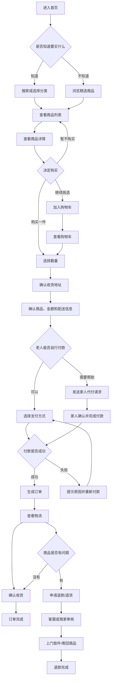
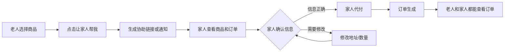
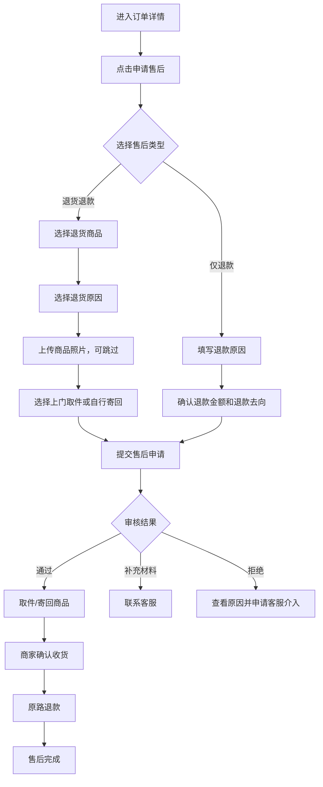
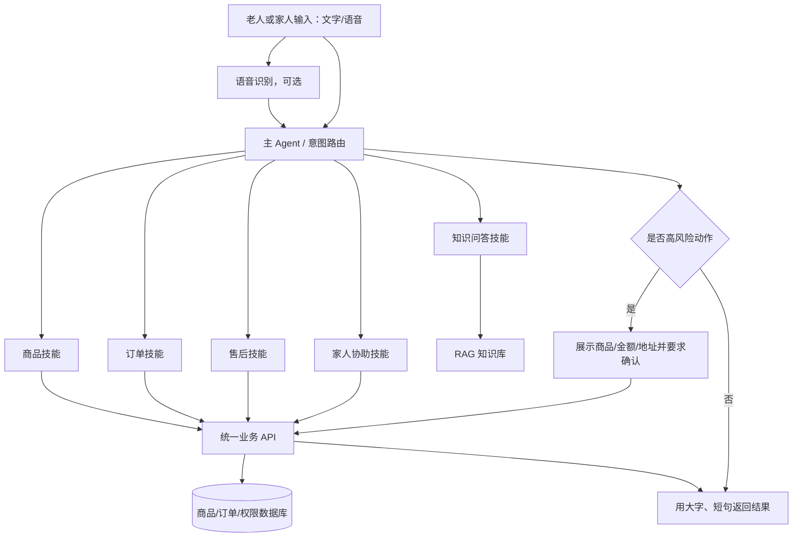

# 老人购物产品 PRD

版本：V1.2

状态：产品方案初稿

更新时间：2026-08-31

## 1. 产品概述

### 1.1 产品定位

“老人购物”是一款帮助老年人完成线上购物、付款、查看订单和申请退货的简易购物服务。

产品不追求商品数量和电商功能的复杂度，而是通过精选商品、大字界面、分步确认、家人协助和人工客服，降低老人线上购物的使用门槛。

### 1.2 核心价值

- 让老人看得懂：商品、价格、地址和订单状态都用清晰语言展示。
- 让老人点得准：减少按钮和页面操作，关键操作提供二次确认。
- 让家人帮得上：支持家人代付、查看订单和协助售后。
- 让售后有保障：退货、退款和客服入口始终可找到。

### 1.3 第一版目标

帮助一名老人独立或在家人协助下完成一次完整购物闭环：

> 浏览商品 → 查看详情 → 确认订单 → 付款 → 查看物流 → 确认收货或申请退货

## 2. 用户与角色

| 角色 | 主要需求 | 核心权限 |
|---|---|---|
| 老人用户 | 买到需要的商品，知道买了什么、何时送到、如何退货 | 浏览、下单、付款、查看订单、申请售后 |
| 家人/照护者 | 远程帮助老人购物和处理订单 | 查看关联订单、代付、修改地址、协助售后 |
| 运营/客服 | 管理精选商品和处理异常 | 商品管理、订单管理、售后处理、客服回复 |

## 3. 产品范围

### 3.1 V1 包含

- 精选商品首页
- 商品分类和商品列表
- 商品详情
- 购物车
- 收货地址
- 确认订单
- 微信支付、家人代付或货到付款
- 订单状态和物流信息
- 取消订单
- 退款/退货申请
- 人工客服
- 家人协助

### 3.2 V1 暂不包含

- 开放式商家入驻
- 直播带货
- 拼团和复杂优惠券
- 自动扣款
- 自建支付系统
- 复杂会员体系
- 多仓库和复杂库存调度

## 4. 产品信息架构

```text
老人购物
├── 首页
│   ├── 推荐商品
│   ├── 商品分类
│   └── 搜索/语音搜索
├── 商品
│   ├── 商品列表
│   └── 商品详情
├── 购物车
│   └── 确认订单
├── 订单
│   ├── 待付款
│   ├── 待发货
│   ├── 配送中
│   ├── 已完成
│   └── 售后中
├── 家人协助
│   ├── 家人代付
│   ├── 共享订单
│   └── 远程协助
└── 客服
    ├── 常见问题
    └── 人工客服
```

## 5. 核心产品流程图

### 5.1 老人购物主流程



### 5.2 家人协助流程



### 5.3 退货退款流程



## 6. 页面与功能需求

### 6.1 首页

#### 页面目标

让老人快速找到常买商品，不需要理解复杂的电商规则。

#### 功能要求

- 展示“常买商品”和“精选商品”。
- 首页最多展示3～5个主要分类。
- 支持输入搜索，V1可先不做语音识别。
- 商品卡片展示大图、名称、价格和“购买”按钮。
- 提供固定的“我的订单”和“联系客服”入口。

#### 设计要求

- 默认字体不小于18px，主要按钮不小于48px高。
- 一屏只突出一个主要操作。
- 不使用过多营销标签和弹窗。

### 6.2 商品详情页

#### 必须展示

- 商品名称
- 商品主图
- 价格
- 规格和数量
- 配送范围
- 预计送达时间
- 退货规则
- 客服入口
- “立即购买”按钮

#### 关键文案

```text
您现在看到的是：伊利纯牛奶 250ml×24盒
价格：98元
预计明天送到
支持7天无理由退货
```

### 6.3 确认订单页

#### 功能要求

- 选择或新增收货地址。
- 修改购买数量。
- 展示商品金额、运费和最终应付金额。
- 展示配送时间。
- 支持“让家人帮我付款”。
- 提交前必须有订单总确认。

#### 确认文案

```text
请确认：
您要购买牛奶2箱，共98元。
商品会送到：上海市浦东新区……
预计明天送达。
```

### 6.4 付款页

#### 支付方式

- 微信支付
- 家人代付
- 货到付款（由运营配置是否支持）

#### 异常处理

- 支付失败：说明失败原因，并保留订单。
- 网络中断：显示“正在确认付款状态”，避免重复支付。
- 用户返回：订单进入“待付款”，不能直接丢失。
- 重复点击：按钮进入加载状态，防止重复提交。

### 6.5 订单页

#### 订单状态

```text
待付款 → 已付款/待发货 → 配送中 → 已送达 → 已完成
                         ↘ 售后中 → 售后完成
```

#### 功能要求

- 每个订单显示当前状态和下一步操作。
- 待付款订单显示“继续付款”。
- 配送中订单显示物流信息。
- 已送达订单显示“确认收货”和“申请售后”。
- 所有订单保留客服入口。

### 6.6 退款/退货页

#### 退款原因

- 商品不需要了
- 商品与描述不一致
- 商品破损
- 商品少件/漏发
- 收到的商品不对
- 其他原因

#### 功能要求

- 默认自动带出可退商品和可退金额。
- 用选择题替代复杂文字填写。
- 上传照片为可选项，必要时由客服补充指导。
- 清楚显示退款去向和预计到账时间。
- 支持客服介入。

## 7. 家人协助设计

### 7.1 家人关系

老人可以绑定1～3名家人，家人可被授权查看订单或协助付款。

### 7.2 权限分级

| 权限 | 说明 |
|---|---|
| 查看订单 | 家人只能查看商品、金额和物流 |
| 协助下单 | 家人可以帮助选择商品和地址 |
| 代付 | 家人可以完成付款 |
| 协助售后 | 家人可以提交或跟进退货退款 |

### 7.3 安全限制

- 家人不能在老人不知情的情况下修改关键账户信息。
- 付款前再次显示商品、金额和地址。
- 重要操作发送老人端提醒。
- 支付密码和银行卡信息不由本产品保存。

## 8. 数据对象

### 用户 User

- 用户ID
- 姓名/昵称
- 手机号
- 用户角色
- 默认收货地址
- 家人关系

### 商品 Product

- 商品ID
- 商品名称
- 商品图片
- 商品价格
- 商品规格
- 库存
- 配送信息
- 售后规则
- 是否精选

### 订单 Order

- 订单ID
- 用户ID
- 商品明细
- 商品金额
- 运费
- 实付金额
- 收货地址
- 支付状态
- 配送状态
- 售后状态
- 创建时间

### 售后 AfterSale

- 售后ID
- 订单ID
- 售后类型
- 售后原因
- 退款金额
- 处理状态
- 物流单号
- 客服备注

## 9. 权限、风险与解决方案

| 风险 | 影响 | 解决方案 |
|---|---|---|
| 老人误操作付款 | 金钱损失 | 付款前二次确认，支持家人代付 |
| 重复付款 | 重复扣款 | 支付按钮防重复，支付状态查询 |
| 地址填写错误 | 商品无法送达 | 默认地址、家人确认、下单前大字展示 |
| 退货流程太复杂 | 老人无法完成售后 | 选择题、人工客服、家人协助 |
| 商品质量问题 | 信任下降 | 精选商品、商家审核、售后追踪 |
| 骚扰和诈骗 | 用户安全风险 | 限制外部链接和陌生客服接触 |

## 10. MVP 验收标准

### 购物流程

- 用户可以在3步内从首页进入商品详情。
- 用户可以看清商品名称、价格、数量和配送时间。
- 用户可以完成地址确认和订单确认。
- 付款失败后，订单不会消失，也不会生成重复订单。

### 订单流程

- 用户能看到订单当前状态。
- 用户能看到物流信息或明确的未发货提示。
- 用户能确认收货。
- 用户能从订单详情进入售后。

### 售后流程

- 用户能在3步内提交退款/退货申请。
- 系统会显示退款金额和退款去向。
- 用户能联系人工客服。
- 家人能查看并协助处理售后订单。

### 老人友好性

- 主要按钮足够大，文字清晰。
- 关键操作不依赖精准点击小图标。
- 每一个付款操作都能在提交前撤回。
- 页面不会同时出现过多主要按钮。

## 11. 开发拆分建议

### 第一阶段：交互原型

- 首页
- 商品列表
- 商品详情
- 确认订单
- 订单详情
- 退货申请

使用模拟商品和模拟订单，不接真实支付。

### 第二阶段：可操作 Demo

- 商品数据管理
- 用户和家人关系
- 模拟支付
- 订单状态流转
- 模拟物流
- 售后状态流转

### 第三阶段：真实服务接入

- 合规支付服务
- 真实物流接口
- 短信或微信通知
- 客服系统
- 商品和供应链管理

## 12. 下一步产品决策

开发前需要确定以下问题：

1. 第一版是做微信小程序，还是先做网页原型？
2. 付款先做真实微信支付，还是先做模拟支付？
3. 家人协助是通过账号绑定，还是通过一次性链接？
4. 第一批商品是否只选择食品和日用品？
5. 退货是否先由人工客服处理？

建议的默认答案是：

> 先做微信小程序原型，使用模拟支付，绑定家人账号，商品只选食品和日用品，退货由人工客服处理。

## 13. 商城接入方案

### 13.1 当前执行方案

第一阶段先做手机网页原型，不接外部商城和真实支付平台。

```text
手机网页前端
├── 老人购物页面
├── 家人代买页面
├── 订单和售后页面
└── 语音助手入口
        ↓
模拟商城服务
├── 模拟商品
├── 模拟库存
├── 模拟订单
├── 模拟物流
└── 模拟支付
```

原型阶段的目标是验证：老人能不能看懂商品、完成下单、理解订单状态，并能在家人帮助下完成退货。

### 13.2 正式落地方案

正式项目采用“自定义老人友好前端 + 可替换商城后台”的结构。

```text
老人购物前端
        ↓
统一业务接口层
        ↓
商城后台
├── 商品和库存
├── 订单
├── 物流
└── 售后退款
        ↓
支付服务和物流服务
```

第一优先评估成熟商城后台，例如有赞等开放平台；如果后续需要更强的权限、家人关系和语音自动化，再逐步替换为自建商城服务。

### 13.3 不直接接入大型综合电商平台

暂不直接接入淘宝、京东或拼多多作为用户购物入口，原因是：

- 商品、订单和售后接口权限可能受限。
- 老人可能被跳转到复杂的第三方页面。
- 家人代买和家人协助售后难以统一。
- 语音助手难以稳定控制第三方页面。

产品需要让老人始终面对一个简单、统一的购物页面。

## 14. 支付方案

### 14.1 原型阶段

使用内部模拟支付接口，不产生真实资金交易。

```text
确认订单
    ↓
点击模拟付款
    ↓
模拟成功/模拟失败
    ↓
更新订单支付状态
```

模拟支付需要覆盖三种结果：

- 支付成功：订单变为“已付款”。
- 支付失败：订单保留为“待付款”。
- 用户取消：返回订单页，不创建重复订单。

### 14.2 正式阶段

真实支付必须由后端创建支付订单，并通过支付回调确认结果。前端不保存支付密钥，模型和语音助手也不能直接执行支付。

正式支付流程：

```text
前端提交订单
    ↓
后端创建支付订单
    ↓
支付平台收银台
    ↓
支付回调/主动查单
    ↓
后端更新订单状态
    ↓
前端展示支付结果
```

## 15. 家人代买与家人售后

### 15.1 家人代买

第一版同时支持两种演示流程：

1. 家人主动选择老人并代为购买。
2. 老人选择商品后发送链接，请家人确认并代付。

家人确认时必须看到：商品、数量、金额、收货地址和预计送达时间。

### 15.2 家人协助退货

家人可以帮助：

- 选择退货商品。
- 填写退货原因。
- 上传商品照片。
- 选择上门取件或自行寄回。
- 查看退款金额和退款进度。
- 联系人工客服。

涉及退款金额、退款去向和最终提交的操作，需要老人或已授权家人再次确认。

## 16. 语音助手方案

### 16.1 V1 语音范围

语音助手采用“点击麦克风后说话”的方式，不使用持续监听。

支持以下指令：

- “我想买两箱牛奶。”
- “帮我看看有没有便宜一点的纸巾。”
- “我的订单到哪里了？”
- “帮我把刚才的牛奶退掉。”
- “让女儿帮我付款。”

### 16.2 语音执行规则

低风险操作可以直接执行：

- 搜索商品。
- 查看商品。
- 查询订单和物流。
- 加入购物车。
- 创建退货草稿。

高风险操作必须二次确认：

- 提交订单。
- 支付。
- 修改地址。
- 提交退款。
- 确认收货。

执行前必须复述商品、数量、金额和地址。例如：

> 您要购买纯牛奶2箱，共98元，送到上海市浦东新区……现在确认购买吗？

## 17. 当前开发顺序

### 第一步：手机网页原型

- 商品首页和分类。
- 商品详情。
- 购物车和确认订单。
- 模拟支付。
- 订单状态。
- 退货申请。

### 第二步：家人协助

- 家人代买。
- 家人代付。
- 家人查看订单。
- 家人协助退货。

### 第三步：语音助手

- 点击麦克风。
- 语音转文字。
- 识别购物意图。
- 调用商品、订单和售后技能。
- 高风险操作二次确认。

### 第四步：真实服务评估

- 评估商城后台。
- 评估微信支付接入。
- 评估物流接口。
- 评估客服和售后系统。

## 18. AI 模型选型

### 18.1 先说结论

本项目统一使用 DeepSeek V4 Pro，不做 GPT 多模型分流，也不训练自己的大模型。模型负责理解用户意图、组织对话和提出工具调用请求；业务后端负责查询、权限校验、状态机、支付和最终执行。

```text
唯一模型：deepseek-v4-pro
接口方式：DeepSeek OpenAI 兼容接口或 Responses API
调用方式：文字/语音转文字 → Agent → 工具调用 → 后端校验 → 页面确认
```

DeepSeek V4 Pro 支持 JSON Output、Tool Calls 和 Responses API，可以满足本项目的 Agent 编排需求。模型版本、价格和可用能力上线前以 DeepSeek 官方文档为准。

原来的 GPT 多模型分层方案不再作为本项目实施方案。

| 场景 | 默认模型 | 推理设置 | 原因 |
|---|---|---|---|
| 所有 AI 场景：意图理解、工具调用、RAG 问答、售后辅助 | DeepSeek V4 Pro | 按实际效果测试 thinking / non-thinking | 单模型实现，减少开发复杂度和模型供应依赖 |

DeepSeek V4 Pro 的输入、输出和高峰时段价格会影响实际账单。开发阶段先记录每次请求的 Token、延迟、工具调用次数和失败原因，再根据真实数据控制预算。

### 18.2 为什么选择 DeepSeek V4 Pro

老人购物不是普通聊天，而是“理解自然语言 → 查询真实数据 → 修改购物车或创建草稿 → 风险确认 → 调用业务接口”的连续流程。主模型需要重点满足：

1. 能正确理解口语化、重复、方言式或不完整的表达。
2. 能在商品、订单、物流和售后工具之间正确路由。
3. 能区分“帮我看看”和“帮我买了”，不把咨询误当成执行。
4. 能在付款、退款、改地址等高风险动作前主动停下来确认。
5. 能把检索到的规则用老人听得懂的短句重新表达。

选择 DeepSeek V4 Pro 的主要原因是：当前项目已经确定只能使用这个模型；它支持结构化输出和工具调用，能覆盖商品搜索、订单查询、家人协助和售后草稿等需求；同时 API Token 成本较低，适合先做小规模 MVP。

需要明确：低成本不等于自动安全。项目必须依靠后端权限、金额校验、状态机、幂等键和二次确认来保证安全，不能把安全责任交给模型本身。

### 18.3 与其他选择的比较

| 方案 | 优势 | 不足 | 本项目结论 |
|---|---|---|---|
| DeepSeek V4 Pro | 成本较低，支持 JSON、Tool Calls 和长上下文 | 复杂流程仍需要严格工具约束和回归测试 | 当前唯一主模型 |
| GPT 等海外模型 | 部分复杂推理和生态能力较强 | 成本、账号可用性和跨境服务条件不符合当前约束 | 不作为本项目依赖 |
| 本地开源小模型 | 数据可控、长期调用成本可控 | 部署、中文口语理解、工具调用和运维成本更高 | 等数据量和调用量达到一定规模后评估 |
| 纯规则系统 | 关键动作可控、可解释 | 无法覆盖老人多样说法，维护规则会快速膨胀 | 用于权限、金额、状态机和风控，不单独承担对话理解 |

真正的对比标准不是“哪个模型宣传更强”，而是同一组任务下的：意图识别准确率、错误调用率、高风险动作拦截率、RAG 有据回答率、平均延迟、每次会话成本和老人完成率。

### 18.4 语音模型与文本模型分工

语音识别、文本理解和语音播报是三个环节，不建议让一个大模型承担所有工作：

```text
老人说话
   ↓
语音识别 ASR：音频 → 文字
   ↓
DeepSeek V4 Pro：理解意图、检索知识、调用业务工具
   ↓
文字回复 / 确认卡片
   ↓
语音合成 TTS：文字 → 语音
```

原型阶段继续使用浏览器语音能力即可；正式阶段再根据目标平台选择当前可用的语音识别、实时语音或语音合成服务。无论使用哪种语音服务，支付密码、银行卡信息和最终扣款都不能交给模型保存或决定。

## 19. Agent 架构

### 19.1 推荐架构：一个主 Agent + 业务技能 + 后端工具

MVP 不建议搭建多个完全独立、互相转交上下文的 Agent。先使用一个主 Agent 负责理解和路由，把具体能力封装成技能和工具；这样更容易调试、审计和控制风险。



### 19.2 主 Agent 负责什么

- 判断用户是在搜索、查看、购买、查询订单还是申请售后。
- 补齐必要信息，例如数量、规格、收货地址和订单号。
- 选择合适的只读工具或业务工具。
- 在动作执行前判断是否需要确认。
- 调用工具后，用老人能理解的短句总结结果。
- 遇到权限不足、规则冲突或信息缺失时，转人工或请求家人协助。

### 19.3 业务技能与工具

技能是面向业务的能力分组，工具是实际可以被调用的后端接口。

| 技能 | 典型工具 | 是否允许直接产生副作用 |
|---|---|---|
| 商品技能 | `search_products`、`get_product_detail`、`update_cart` | 搜索和查看可以；修改购物车需记录用户意图 |
| 订单技能 | `create_order_draft`、`get_order`、`get_logistics` | 创建草稿可以；正式提交订单需确认 |
| 付款技能 | `create_payment_intent`、`query_payment_status` | 只能由后端在授权和确认后执行，模型不能直接扣款 |
| 售后技能 | `create_after_sale_draft`、`get_after_sale_status` | 创建退货草稿可以；提交退款需确认 |
| 家人技能 | `request_family_payment`、`notify_family`、`check_family_permission` | 必须校验绑定关系和授权范围 |
| 客服技能 | `create_support_ticket`、`get_faq_answer` | 可创建客服工单，不可伪造平台处理结果 |

每个工具说明中必须写清楚：用途、必填参数、返回字段、权限要求、是否有副作用、是否幂等、可重试错误和不可重试错误。模型只负责提出调用请求，后端必须再次校验用户身份、权限、订单状态和金额。

### 19.4 高风险动作闸门

以下动作不能只凭一句语音直接执行：付款、退款、改地址、确认收货、解除家人绑定。

统一执行协议：

```text
用户表达意图
    ↓
模型整理为结构化草稿
    ↓
后端校验身份、权限、订单状态和金额
    ↓
前端大字展示待执行内容
    ↓
老人或已授权家人明确确认
    ↓
后端使用幂等键执行
    ↓
记录审计日志并返回结果
```

模型不能绕过确认按钮、不能读取支付密码、不能自行修改权限，也不能把“我想退货”直接解释为“退款已经完成”。

## 20. RAG 知识库方案

### 20.1 RAG 是什么

RAG（Retrieval-Augmented Generation，检索增强生成）就是先从项目知识库找到相关内容，再让模型依据这些内容回答。它适合解决“平台规则是什么”“这件商品能不能退”“上门取件怎么安排”等知识问题。

RAG 不应该代替实时业务接口：订单状态、库存、价格、地址、支付状态必须查数据库或调用业务 API，不能从知识库猜。

### 20.2 第一批知识库内容

```text
知识库
├── 退货退款规则
├── 商品说明和使用注意事项
├── 配送范围、配送时间和运费规则
├── 家人代买、代付和权限说明
├── 常见问题 FAQ
├── 老人版操作说明
├── 客服话术和异常处理规则
└── 不同地区/不同商品的特殊政策
```

### 20.3 入库流程

```text
收集文档
  ↓
清理重复内容、过期规则和内部备注
  ↓
按“一个问题/一个规则/一个步骤”切分
  ↓
生成向量并写入向量库
  ↓
附加商品、地区、版本、生效时间和权限标签
  ↓
用测试问题验证召回结果
  ↓
发布为当前有效知识版本
```

每个知识片段至少记录：`source_id`、`title`、`doc_type`、`product_id`、`region`、`effective_from`、`effective_to`、`version`、`audience` 和 `status`。规则变更时不要直接覆盖旧内容，要保留版本并根据生效时间过滤。

### 20.4 检索流程

1. 先识别用户问题属于商品、配送、支付、售后还是家人协助。
2. 将口语问题改写成检索词，例如“这个不要了怎么退”改写为“订单退货退款流程和条件”。
3. 按商品、地区、用户角色和当前生效时间过滤。
4. 召回少量相关片段，再让模型组织答案。
5. 若没有足够依据，明确说“我没有找到确定规则”，转人工客服，不允许模型自行编造。
6. 对客服和家人端保留来源标题、规则版本和更新时间，方便追溯。

### 20.5 技术落地选择

- 原型和小规模 MVP：可使用托管的 File Search / Vector Store，减少自建切分、索引和检索服务的工作量。
- 正式项目：如果需要复杂的地区、商品、权限和生效时间过滤，可采用“关键词检索 + 向量检索 + 元数据过滤”的混合方案，并把知识库封装在自己的 `knowledge_search` 接口后面。
- 无论使用托管还是自建，知识库都只提供参考内容，最终订单、价格、库存、退款金额必须以后端真实数据为准。

## 21. PE：Prompt Engineering 提示词工程

### 21.1 PE 在本项目中的含义

PE 不是再训练一个模型，而是把产品规则写成模型能够稳定执行的指令、工具说明、输出格式和测试用例。它解决的是“模型应该怎么说、什么时候调用工具、什么时候停下来确认”。

### 21.2 提示词分层

```text
全局安全规则
  ↓
老人购物主 Agent 规则
  ↓
具体技能规则
  ↓
工具说明和参数约束
  ↓
用户身份、权限、订单上下文
  ↓
RAG 检索到的有效知识
```

不要把所有内容塞进一段超长提示词。稳定的规则放在前面，用户订单和检索结果等动态内容放在后面；工具的副作用和参数约束写在工具描述中。

### 21.3 主 Agent 提示词骨架

```text
你是“老人购物”语音和文字助手。

目标：帮助老人安全完成查商品、购物车、订单查询、家人协助和售后操作。

交互规则：
1. 使用普通、短句、无术语的中文；一次只询问一个缺失信息。
2. 先判断用户想了解什么，再决定是否调用工具。
3. 查询价格、库存、物流、退款金额时必须调用真实业务工具，不能猜测。
4. 付款、退款、改地址、确认收货和绑定权限前，必须展示关键内容并等待明确确认。
5. 用户只说“看看”“了解一下”时，只读查询，不创建订单、不付款、不提交售后。
6. 工具报错时说明下一步，不要声称操作成功。
7. 无法确定时向用户提一个最小问题，或转人工/家人协助。

输出：给用户一句简短说明；如果需要确认，清楚列出商品、数量、金额、地址和下一步按钮。
```

### 21.4 结构化输出

模型对主 Agent 的判断建议使用结构化输出，而不是让后端解析一段自然语言：

```json
{
  "intent": "create_order_draft",
  "entities": {
    "product_id": 1,
    "quantity": 2,
    "address_id": null
  },
  "confidence": 0.94,
  "requires_confirmation": true,
  "missing_fields": ["address_id"],
  "reply": "我可以先帮您准备两箱牛奶，还需要确认收货地址。"
}
```

结构化输出只代表“模型提出了一个计划”，不代表后端已经执行。后端仍要进行权限、状态、金额和幂等校验。

### 21.5 PE 测试集与验收指标

上线前准备至少 50～100 条真实或模拟表达，覆盖：口语、省略、重复、听错、同音词、老人改口、家人代付、重复点击、退款金额确认和恶意指令。

重点指标：

- 意图路由准确率。
- 工具参数完整率。
- 高风险动作误执行率，目标为 0。
- 必须确认场景的确认拦截率。
- RAG 有依据回答率和过期规则命中率。
- 首次完成购物的成功率。
- 平均响应时间和单次会话成本。

提示词要像代码一样版本管理，每次修改都用同一组测试集回归。模型官方指南也建议从较精简、以结果为导向的提示词开始，并通过代表性任务比较质量、成本和延迟；不要靠不断堆规则解决问题。

## 22. 推荐技术路线

### 阶段 A：当前原型

- 不接真实模型，使用模拟商品、模拟订单和模拟支付。
- 保留语音按钮和固定演示指令。
- 先观察老人是否理解页面和确认步骤。

### 阶段 B：AI MVP

- 后端接入 DeepSeek V4 Pro 的 OpenAI 兼容接口或 Responses API。
- DeepSeek V4 Pro 作为唯一主 Agent，先分别测试 thinking 和 non-thinking 模式。
- 先开放只读工具：商品搜索、商品详情、订单查询、物流查询和 FAQ 检索。
- 接入第一版 RAG：退货规则、配送规则、家人协助说明。
- 付款、退款和改地址仍只创建草稿，不直接执行。

### 阶段 C：受控执行

- 增加家人权限校验、明确确认卡片、幂等键和审计日志。
- 增加创建订单草稿、退货草稿和家人协助请求。
- 对高风险工具增加后端审批闸门。
- 通过规则和工具权限控制复杂度，不依赖第二个模型分流。

### 阶段 D：正式运营

- 接入真实商城、支付、物流和客服服务。
- 记录模型版本、提示词版本、知识版本、工具调用和用户确认记录。
- 持续用真实脱敏样本做评测，模型升级必须通过回归测试。

## 23. 本次技术决策记录

本项目当前采用以下默认方案：

> DeepSeek V4 Pro 作为唯一模型；采用 DeepSeek OpenAI 兼容接口或 Responses API；采用一个主 Agent 加业务技能和后端工具；RAG 只处理规则、FAQ 和商品知识；订单、库存、支付、权限和退款金额只相信业务 API；PE 负责提示词、工具契约、确认规则和评测集。

CLI、CFT 或其他开发辅助工具不是这个产品上线的必要条件。它们最多帮助开发和编排，不能替代后端权限、支付风控、Agent 工具契约和 RAG 数据治理。

## 24. DeepSeek 成本预算

### 24.1 计算公式

```text
模型成本 = 输入 Token ÷ 1,000,000 × 输入单价
         + 输出 Token ÷ 1,000,000 × 输出单价
```

以下仅计算 DeepSeek V4 Pro 的文本模型费用，不包含服务器、数据库、语音识别、语音播报、短信、支付渠道、物流接口和人工客服费用。价格以 DeepSeek 官方价格页为准，可能调整。

### 24.2 单次请求估算

假设一次模型请求包含 2,000 个输入 Token 和 500 个输出 Token：

| 时段 | 输入单价 | 输出单价 | 单次请求估算 |
|---|---:|---:|---:|
| 非高峰 | $0.66 / 百万 Token | $1.98 / 百万 Token | $0.00231 |
| 高峰 | $1.32 / 百万 Token | $3.96 / 百万 Token | $0.00462 |

DeepSeek 官方标注的工作日高峰时段为 UTC 01:00～04:00 和 06:00～10:00，换算为北京时间约为 09:00～12:00 和 14:00～18:00。

### 24.3 月度预算示例

| 月模型请求量 | 非高峰估算 | 高峰估算 |
|---:|---:|---:|
| 1,000 次 | $2.31 | $4.62 |
| 20,000 次 | $46.20 | $92.40 |
| 40,000 次 | $92.40 | $184.80 |
| 100,000 次 | $231.00 | $462.00 |

一个可参考的场景是：每月 1,000 位用户，每位用户 20 次 AI 交互，每次交互平均触发 2 次模型调用，共 40,000 次模型请求。对应模型费用约为 $92.40～$184.80，实际还要考虑重试、超长上下文和 Token 增长。

RAG 片段、历史对话、系统提示词和工具说明都会计入输入 Token。每增加一次 Agent 循环，模型费用也会近似增加一次，因此要记录 `input_tokens`、`output_tokens`、`tool_calls`、`latency_ms` 和 `error_code`。

## 25. VS Code 开发方案

### 25.1 开发原则

- 继续以手机网页原型作为前端起点，不先重写界面。
- 先使用本地模拟商品、模拟订单和模拟支付，确认流程后再接真实服务。
- DeepSeek API Key 只放在后端环境变量中，不能写进前端 JavaScript。
- 第一阶段只允许查询和创建草稿，不允许模型直接付款、退款或修改地址。

### 25.2 推荐目录

```text
老人购物/
├── frontend/                 # 手机网页前端，可由当前原型迁入
│   ├── index.html
│   ├── styles.css
│   └── app.js
├── server/                   # 后端服务
│   ├── src/
│   │   ├── index.js
│   │   ├── deepseek.js       # DeepSeek 客户端封装
│   │   ├── agent/
│   │   │   ├── router.js     # 意图路由
│   │   │   └── prompts.js    # PE 提示词
│   │   ├── tools/
│   │   │   ├── products.js
│   │   │   ├── orders.js
│   │   │   ├── afterSales.js
│   │   │   └── family.js
│   │   └── rag/
│   │       ├── knowledge.js
│   │       └── documents/
│   ├── .env.example
│   └── package.json
├── data/
│   ├── products.json
│   ├── orders.json
│   └── family.json
├── PRD-老人购物.md
└── README.md
```

现有的 `老人购物原型` 文件夹可以先作为 `frontend` 使用，不需要为了开始开发而立即重构。

### 25.3 环境变量

后端创建 `.env`，不要提交到 Git：

```env
DEEPSEEK_API_KEY=填写你的密钥
DEEPSEEK_BASE_URL=https://api.deepseek.com
DEEPSEEK_MODEL=deepseek-v4-pro
PORT=3000
```

`.env.example` 只保留变量名和示例值。生产环境使用服务器的密钥管理服务，不把密钥发送到浏览器。

### 25.4 第一批后端接口

| 接口 | 用途 | 第一阶段是否执行真实副作用 |
|---|---|---|
| `POST /api/agent/chat` | 接收文字或语音转写文本，返回 Agent 结果 | 否 |
| `GET /api/products` | 商品搜索和分类 | 只读 |
| `GET /api/products/:id` | 商品详情 | 只读 |
| `POST /api/cart` | 修改购物车 | 修改本地模拟数据 |
| `POST /api/orders/drafts` | 创建订单草稿 | 不扣款 |
| `GET /api/orders/:id` | 查询订单和物流 | 只读 |
| `POST /api/after-sales/drafts` | 创建退货草稿 | 不退款 |
| `POST /api/family/payment-request` | 创建家人代付请求 | 发送模拟通知 |

### 25.5 VS Code 开发顺序

1. 用 VS Code 打开 `项目合集`，新建独立的 `老人购物` 开发目录或直接整理现有原型目录。
2. 先把商品、订单和家人数据从前端硬编码迁移到 `data/` 和后端接口。
3. 建立后端服务，先实现商品查询、订单查询和订单草稿。
4. 接入 DeepSeek V4 Pro，完成一个最小 Agent：识别“查商品”“查订单”“申请退货”三类意图。
5. 为 Agent 注册只读工具和草稿工具，暂时不注册真实支付工具。
6. 加入本地 Markdown FAQ，先实现最简单的 RAG 检索。
7. 前端语音转文字后调用 `/api/agent/chat`，把 Agent 返回的结果展示为大字确认卡片。
8. 用测试集回归：买牛奶、查物流、申请退货、让家人代付、拒绝付款和重复点击。

### 25.6 第一阶段完成标准

- VS Code 中可以一键启动前端和后端。
- 用户可以用文字或语音转写查询商品和订单。
- Agent 可以调用商品查询、订单查询和售后草稿工具。
- 任何付款、退款和改地址操作都只能生成待确认草稿。
- API Key 不出现在浏览器代码、日志或 Git 提交中。
- 记录每次模型调用的 Token、耗时、工具名称和结果。
